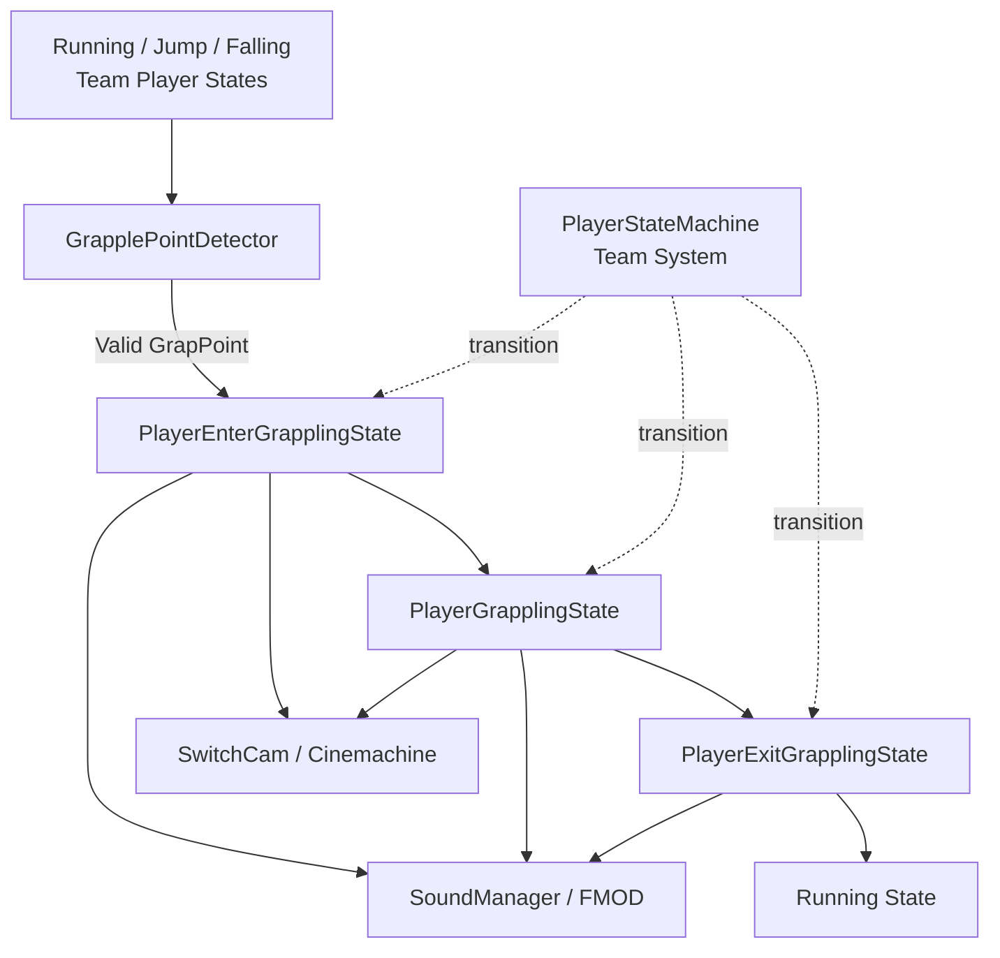
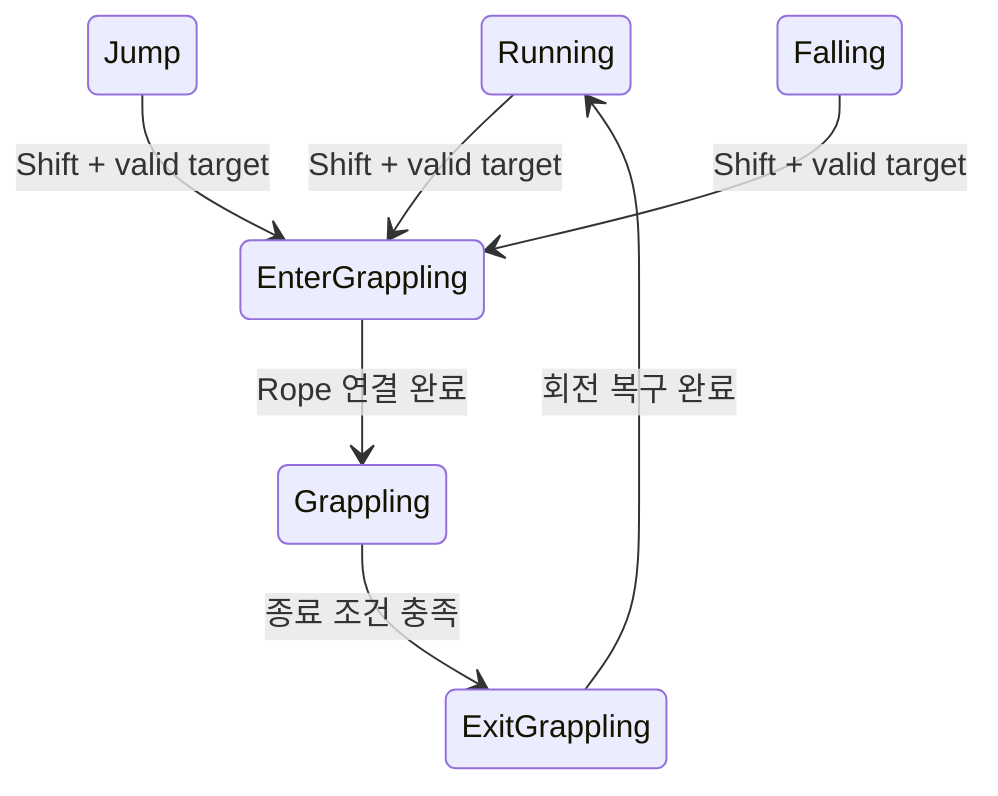
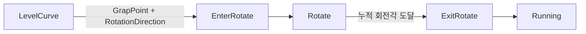

# Rope Architecture

## 전체 구조

제가 구현한 Rope는 팀 Player State에서 입력을 받아 Target을 찾고 Enter·Swing·Exit 순서로 진행합니다.

점선으로 표시한 PlayerStateMachine은 팀 공용 시스템입니다.

## Target Detection

[`GrapplePointDetector`](../Evolution/RopeAction/04_Release/Targeting/GrapplePointDetector.cs#L84-L133)는 크기 10의 Collider 배열을 재사용하고 `Physics.OverlapSphereNonAlloc`으로 후보를 찾습니다.

1. Linkable Layer
2. Detection radius 내부
3. Player `transform.forward` 기준 45도 이내
4. Target 방향과 forward의 Dot product가 양수

조건을 통과한 GameObject를 Player의 `GrapPoint`로 전달하고 Enter 상태로 전환합니다.

→ [Indicator 갱신 코드](../Evolution/RopeAction/04_Release/Targeting/GrapplePointDetector.cs#L33-L80)

## Linear Rope

→ [Enter](../Evolution/RopeAction/04_Release/LinearRope/PlayerEnterGrapllingState.cs#L16-L96) · [Swing](../Evolution/RopeAction/04_Release/LinearRope/PlayerGrapplingState.cs#L45-L69) · [Exit](../Evolution/RopeAction/04_Release/LinearRope/PlayerExitGrapllingState.cs#L14-L72)

## Rotation Rope

`LevelCurve.rotationDirection`의 -1 또는 1 값을 Player에 전달하고, Rotate State에서 해당 값에 따라 수평 회전 방향을 바꿨습니다.

→ [LevelCurve Trigger](../Evolution/RopeAction/04_Release/RotationRope/LevelCurve.cs#L21-L30) · [Rotation 계산](../Evolution/RopeAction/04_Release/RotationRope/PlayerRotateGrapplingState.cs#L42-L66) · [Exit 회전 복구](../Evolution/RopeAction/04_Release/RotationRope/PlayerExitRotateGrapplingState.cs#L39-L70)

## Camera

`SwitchCam`은 현재 Player State에 따라 다음 Cinemachine Virtual Camera를 선택합니다.

- Main
- Rope Start
- Rope Swing
- Rope Rotate
- Curve Left / Right
- Ending

Camera 전환을 수행하는 CameraManager는 팀원 코드이므로 이 저장소에는 포함하지 않았습니다.

→ [`SwitchCam.Update`](../Source/Camera/SwitchCam.cs#L28-L60) · [Camera 등록/해제](../Source/Camera/CameraRegister.cs#L11-L19)

## Sound

Rope lifecycle은 하나의 FMOD Event와 `Type` parameter를 공유합니다.

| 단계 | Parameter |
|---|---:|
| Enter 시작 | 0 |
| Rope 연결 | 1 |
| Swing | 2 |
| Exit | 3 |

각 상태가 시작될 때 해당 parameter를 호출해 Rope의 진행 단계와 Sound가 함께 바뀌도록 연결했습니다.

→ [Enter Sound](../Evolution/RopeAction/04_Release/LinearRope/PlayerEnterGrapllingState.cs#L16-L30) · [Swing Sound](../Evolution/RopeAction/04_Release/LinearRope/PlayerGrapplingState.cs#L18-L24) · [Exit Sound](../Evolution/RopeAction/04_Release/LinearRope/PlayerExitGrapllingState.cs#L14-L21)
