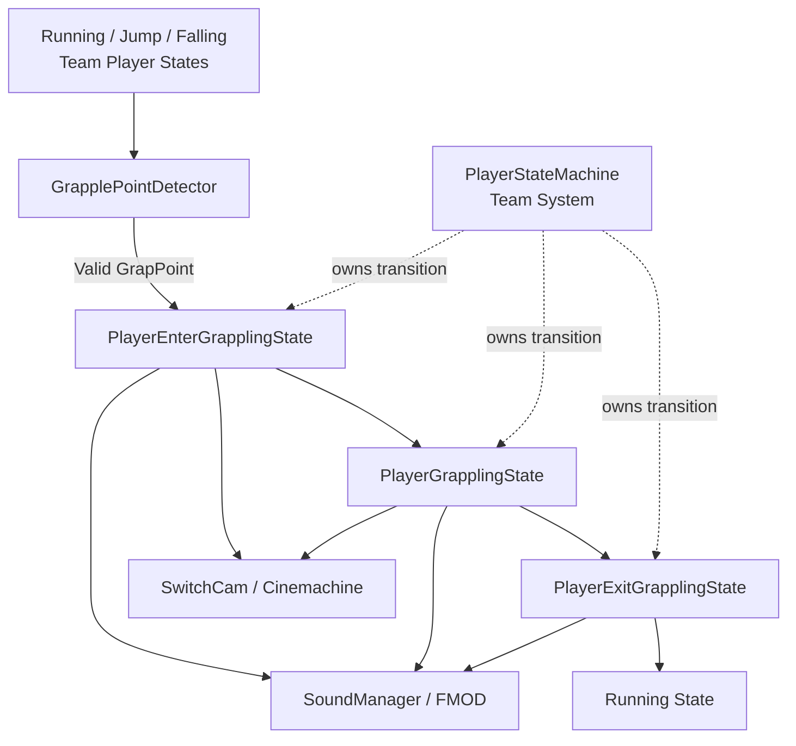
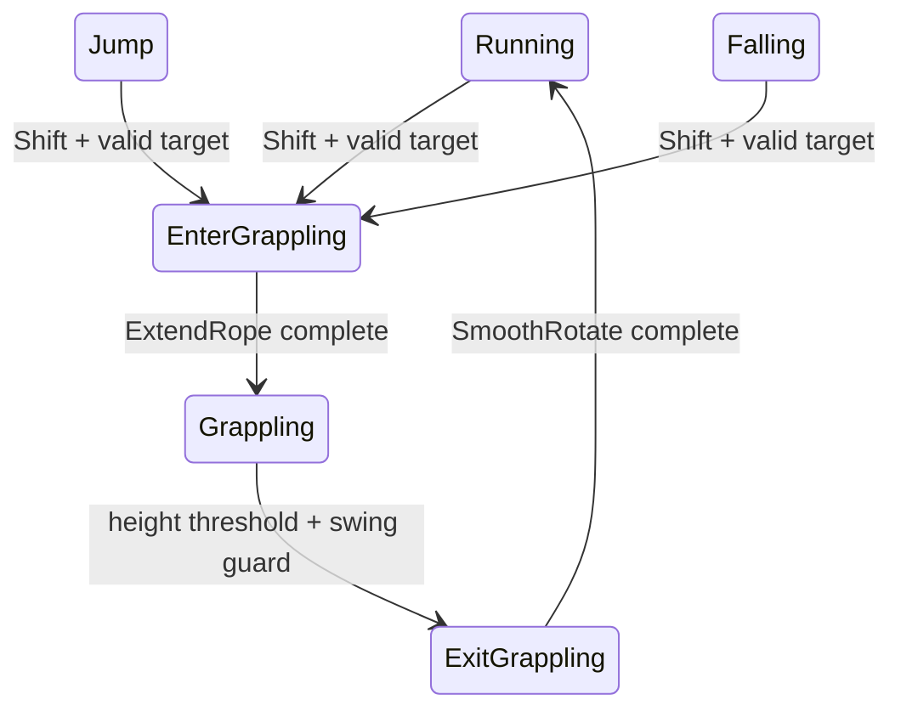
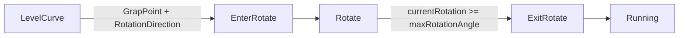

# Rope Architecture

## 전체 흐름

실선은 Rope 기능 흐름, 점선은 포함하지 않은 팀 시스템 의존성을 의미합니다.

## Target Detection

`GrapplePointDetector`는 매 탐색마다 배열을 새로 만드는 대신 크기 10의 Collider 배열을 보유하고 `Physics.OverlapSphereNonAlloc`을 사용합니다.

후보는 다음 기준을 통과해야 합니다.

1. `Linkable` Layer
2. Detection radius 내부
3. Player `transform.forward` 기준 45도 이내
4. Target 방향과 forward의 Dot product가 양수

현재 구현은 물리 API가 반환한 첫 유효 Collider를 사용하며 후보 우선순위 정렬은 하지 않습니다.

## Linear Rope State

## Rotation Rope

`LevelCurve.rotationDirection`은 `-1` 또는 `1` 값을 Player에 전달합니다. Rotate State는 이 값에 따라 `Vector3.up` 축 회전 방향을 바꾸고 누적 각도가 최대 각도에 도달하면 Exit로 전환합니다.

## Camera

`SwitchCam`은 현재 Player State의 실제 타입을 확인하고 CameraManager에 다음 Virtual Camera를 전달합니다.

- Main
- Rope Start
- Rope Swing
- Rope Rotate
- Curve Left / Right
- Ending

`CameraManager`는 팀원 작성 코드이므로 Repository에 포함하지 않았습니다.

## Sound

Linear Rope lifecycle은 하나의 FMOD Event와 `Type` parameter를 공유합니다.

| 단계 | Parameter |
|---|---:|
| Enter 시작 | 0 |
| Rope 연결 | 1 |
| Swing | 2 |
| Exit | 3 |

SoundManager와 FMOD Bank가 없어 단독 재생할 수 없지만, 상태와 Sound parameter의 연결은 원본 코드에서 확인할 수 있습니다.
