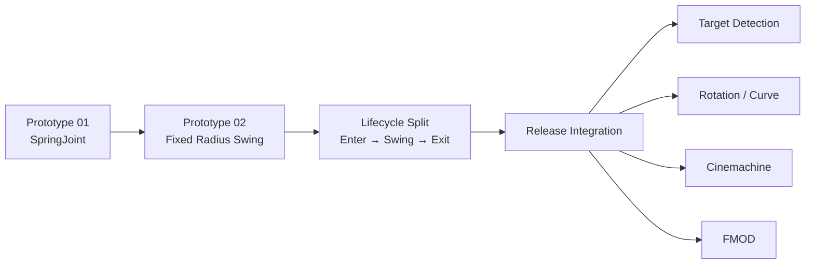
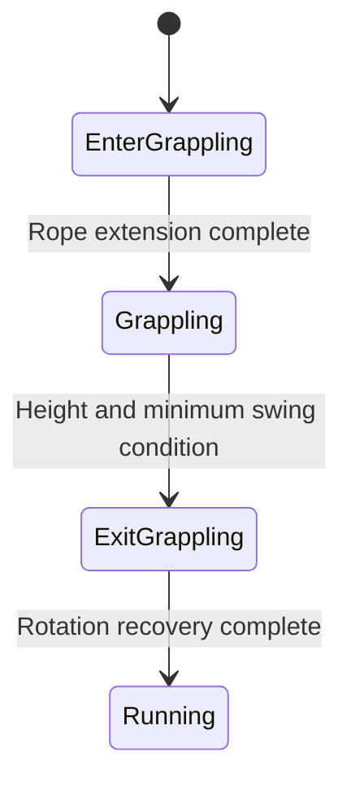

# DoDoDoIt! — Rope Action Engineering

12인 팀으로 제작한 3D Rope Action Running Game **DoDoDoIt!**에서 담당한 Gameplay 코드를 Git 이력과 함께 정리한 코드 전시용 Repository입니다.

> SpringJoint로 빠르게 검증한 Rope Action을 고정 반경·회전 기반 이동으로 전환하고, Rope lifecycle 분리와 로컬 좌표 기반 방향 처리, Cinemachine·FMOD·Curve Level 통합 및 Release 안정화까지 발전시킨 과정입니다.

## Repository 목적

이 Repository는 실행 가능한 Unity 프로젝트가 아닙니다.

- 원본 팀 프로젝트에서 실제 사용한 `.cs` 파일만 해당 Git Commit에서 추출했습니다.
- Scene, Prefab, GameObject, Material, Animation, `.meta`, Packages는 포함하지 않습니다.
- 누락된 팀 시스템을 Stub이나 Mock으로 대체하지 않습니다.
- 코드의 오탈자, Magic Number, Debug Log와 Known Issue도 원본 그대로 보존합니다.
- 각 파일은 복사 시 Commit 원본과 SHA-256 동일성을 검증했습니다.

## 담당 범위

- Rope Action Prototype 및 Release 구현
- Rope Enter / Swing / Exit lifecycle
- Target Detection과 회전된 레벨의 방향 판정
- Rotation Rope / Curve Level 대응
- Rope 상태별 Cinemachine Camera 전환
- Rope 단계별 FMOD Sound 연동
- 실제 레벨에서 발생한 Rope Edge Case 안정화

Player 공용 StateMachine과 Release의 Player 이동 상태는 팀 공동 시스템입니다. 본 Repository는 이를 본인 설계로 주장하지 않으며, Rope 기능이 의존한 외부 팀 시스템으로 구분합니다.

## 개발 변화

| 단계 | Commit | 핵심 변화 |
|---|---|---|
| Prototype 01 | `1ff69ecb` | Mouse Raycast 지점에 런타임 `SpringJoint`를 생성 |
| Prototype 02 | `51c040b8` | Target 탐색과 고정 반경 `RotateAround` 이동을 하나의 Grappling State에 구현 |
| Lifecycle Split | `a59070ce` | Rope 연결·Swing·종료를 Enter / Grappling / Exit로 분리 |
| Release | `c0247122` | Targeting, Rotation Rope, Camera, Sound 및 레벨 Edge Case 통합 |

자세한 변화 근거는 [RopeEvolution.md](Docs/RopeEvolution.md)에서 확인할 수 있습니다.

## 핵심 기술 판단

### 1. 물리 반응을 이용한 검증에서 명시적인 이동 규칙으로

Prototype 01은 최초 거리의 비율로 `SpringJoint.minDistance`와 `maxDistance`를 설정하고 Spring·Damper로 Player를 당겼습니다. 빠르게 Rope 감각을 확인하기에는 적합했지만 결과가 Player의 진입 위치, 속도와 Rigidbody 상태의 영향을 받는 구조였습니다.

Prototype 02부터는 속도, 회전축, 각속도와 반경을 코드에서 직접 정했습니다. 이는 SpringJoint 값을 단순히 변경한 것이 아니라 Rope 구간의 이동 결과를 게임 규칙으로 통제하는 방향으로 바꾼 것입니다.

### 2. 단일 Grappling State를 lifecycle로 분리

Prototype 02에서는 Target 탐색, Rope 표시, Swing, 종료와 회전 복구가 한 State에 포함됐습니다. `a59070ce`에서 다음 책임으로 분리했습니다.

- Enter: Rope 연장 연출, Target 방향 정렬, 진입 물리
- Swing: 고정 반경 보정, 회전, 종료 판정
- Exit: 이탈 속도, Player/GFX 회전 복구

### 3. 월드 축에서 Player 로컬 축으로

초기 Swing은 `Vector3.left`와 월드 좌표 비교에 의존했습니다. 꺾인 레벨에서는 Player 진행 방향과 계산 기준이 달라질 수 있어 `transform.forward`, `transform.right`, Cone angle과 Dot product를 기준으로 변경했습니다.

### 4. 상태를 Camera와 Sound의 공통 기준으로 사용

`SwitchCam`은 Enter, Swing, Rotation, 좌·우 Curve와 Ending 상태에 맞는 Cinemachine Virtual Camera를 선택합니다. Rope State는 같은 lifecycle에 맞춰 FMOD `Type` parameter 0~3을 호출합니다.

### 5. Release 레벨에서의 안정화

Git History에는 다음 수정이 남아 있습니다.

| 문제 | Commit | 코드 변화 |
|---|---|---|
| 꺾인 레벨에서 잘못된 Swing 방향 | `85caf2b8`, `e26ed65a` | Player 로컬 축과 전방 Cone 판정 도입 |
| Tutorial 구간 추락 | `a85b8242` | Swing 전진 속도를 명시적인 값으로 보정 |
| Rope가 너무 일찍 종료됨 | `277cd7ad` | 최소 Swing 유지 조건 추가 |
| Swing 회전이 특정 높이 이후 멈춤 | `0a82c9c3` | `RotateAround` 실행 위치를 높이 조건 밖으로 이동 |
| Ground에서 Rope 진입 시 움직임 단절 | `d8f6662a` | Ground 진입 중 전방 이동 유지 |
| Rotation Rope와 Curve 확장 | `f009a55a` 이후 | 전용 Enter/Rotate/Exit와 방향 전달 추가 |

상세 내용은 [ReleaseStabilization.md](Docs/ReleaseStabilization.md)를 참고하십시오.

## 코드 탐색

| 코드 | 위치 | 검토 포인트 |
|---|---|---|
| SpringJoint Prototype | `Evolution/RopeAction/01_Prototype01/` | 빠른 Prototype 구성과 물리 의존성 |
| 단일 Grappling State | `Evolution/RopeAction/02_Prototype02/` | 고정 반경 Swing의 초기 형태와 책임 집중 |
| Lifecycle Split | `Evolution/RopeAction/03_LifecycleSplit/` | Enter/Swing/Exit 책임 분리 |
| Release Linear Rope | `Evolution/RopeAction/04_Release/LinearRope/` | 최종 Rope 상태 전환과 이동 계산 |
| Target Detection | `Evolution/RopeAction/04_Release/Targeting/` | NonAlloc 탐색, Cone, Dot 판정 |
| Rotation Rope | `Evolution/RopeAction/04_Release/RotationRope/` | 방향값과 누적 회전을 이용한 Curve 대응 |
| Camera | `Source/Camera/` | Player State별 Cinemachine Camera 전환 |

## 코드 소유권

Git 설정의 `duckbaee23`과 Commit 작성자 `DuckBaee`를 본인으로 판단했습니다. 파일별 본인·공동 수정 여부와 blame 집계는 [CodeOwnership.md](Docs/CodeOwnership.md)에 기록했습니다.

공동 수정 파일은 팀 코드가 포함됐음을 명시하며, 해당 파일 전체를 본인 단독 구현으로 주장하지 않습니다. 특히 `PlayerStateMachine`, `IPlayerState`, `PlayerController`는 팀 공용 시스템이므로 Repository에 복사하지 않았습니다.

## 문서

- [ProjectOverview.md](Docs/ProjectOverview.md): 프로젝트와 담당 범위
- [RopeEvolution.md](Docs/RopeEvolution.md): Prototype에서 Release까지의 변화
- [RopeArchitecture.md](Docs/RopeArchitecture.md): 상태·탐색·Camera·Sound 관계
- [ReleaseStabilization.md](Docs/ReleaseStabilization.md): 실제 레벨 Edge Case 수정
- [Dependencies.md](Docs/Dependencies.md): 포함하지 않은 팀·외부 시스템
- [CodeOwnership.md](Docs/CodeOwnership.md): 파일별 작성자 및 Commit
- [KnownIssues.md](Docs/KnownIssues.md): 원본 코드에서 확인된 개선 지점

## 검토 시 참고

이 코드는 12인 팀 프로젝트의 Release 결과를 원본 그대로 보존한 자료입니다. 독립 컴파일 여부보다 다음 내용을 검토할 수 있도록 구성했습니다.

1. Prototype 구현과 다음 단계의 차이
2. 플레이 문제에 따라 제어 방식을 변경한 과정
3. Rope lifecycle과 시스템 간 책임 경계
4. 회전된 Level에서 좌표 기준 문제를 해결한 방식
5. 제출 직전까지 실제 콘텐츠 Edge Case를 수정한 이력
