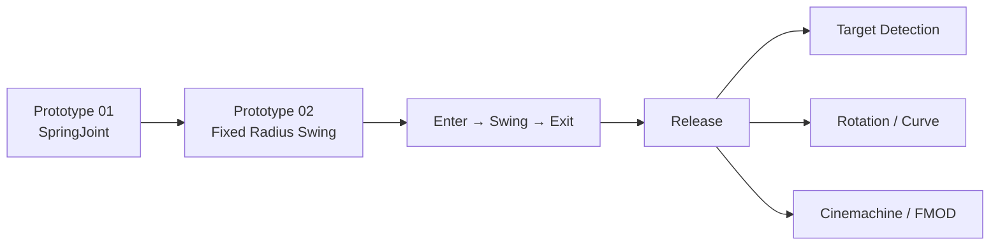
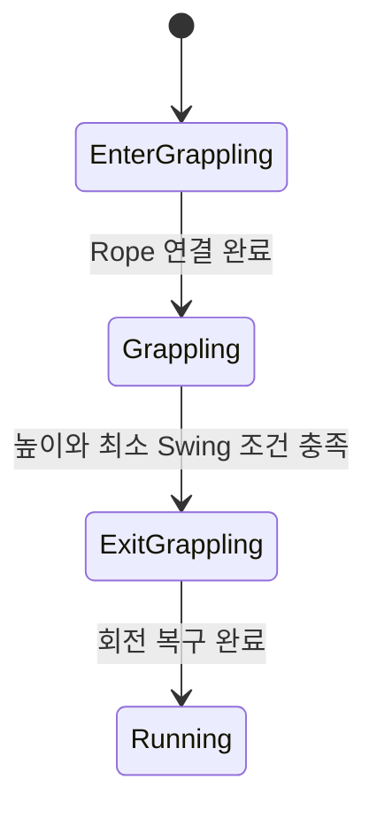

# DoDoDoIt! — Rope Action

안녕하세요. 12인 팀으로 제작한 3D Rope Action Running Game **DoDoDoIt!**에서 클라이언트 프로그래밍을 담당했습니다.

이 저장소에는 제가 맡았던 로프 액션이 Prototype에서 Release까지 어떻게 바뀌었는지 실제 코드와 Git 이력으로 정리했습니다.

> SpringJoint로 로프 액션을 빠르게 검증한 뒤, 플레이 결과를 더 직접적으로 제어하기 위해 고정 반경·회전 기반 이동으로 변경했습니다. 이후 Rope를 Enter·Swing·Exit 상태로 나누고 Camera·Sound·UI와 연결해 최종 제출 빌드까지 안정화했습니다.

## 프로젝트

| 항목 | 내용 |
|---|---|
| 프로젝트 | DoDoDoIt! |
| 장르 | 3D Rope Action Running Game |
| 인원 | 12명 |
| 엔진 | Unity 2022.3 |
| 담당 | Player 이동·Jump 연동, Rope Action, Cinemachine Camera, Player Sound·UI 연동, 통합 및 안정화 |

## 제가 맡은 부분

- SpringJoint 기반 Rope Prototype 제작
- 고정 반경·회전 기반 Swing 구현
- Rope Enter / Swing / Exit 상태 구현
- Target Detection과 회전된 레벨의 방향 판정
- Rotation Rope와 Curve Level 대응
- Rope 상태별 Cinemachine Camera 전환
- Rope 진행 단계별 FMOD Sound 연동
- Ground 진입, 조기 종료, 추락, 방향 오류 등 Release 문제 수정

## 개발 과정

| 단계 | Commit | 제가 바꾼 내용 | 코드 |
|---|---|---|---|
| Prototype 01 | `1ff69ecb` | Raycast 위치에 `SpringJoint`를 연결해 로프 플레이를 먼저 확인했습니다. | [SpringJoint 연결](Evolution/RopeAction/01_Prototype01/RopeActionWithRunning.cs#L67-L93) |
| Prototype 02 | `51c040b8` | SpringJoint 대신 고정 반경과 `RotateAround`로 Swing 경로를 직접 계산했습니다. | [Target 탐색](Evolution/RopeAction/02_Prototype02/PlayerGrapplingState.cs#L85-L102) · [Swing 계산](Evolution/RopeAction/02_Prototype02/PlayerGrapplingState.cs#L104-L147) |
| Lifecycle Split | `a59070ce` | 하나의 Grappling State에 모여 있던 연결·이동·종료를 Enter / Swing / Exit로 나눴습니다. | [Enter](Evolution/RopeAction/03_LifecycleSplit/PlayerEnterGrapllingState.cs#L18-L91) · [Swing](Evolution/RopeAction/03_LifecycleSplit/PlayerGrapplingState.cs#L43-L80) · [Exit](Evolution/RopeAction/03_LifecycleSplit/PlayerExitGrapllingState.cs#L13-L55) |
| Release | `c0247122` | Targeting, Rotation Rope, Camera, Sound를 연결하고 실제 레벨 문제를 수정했습니다. | [Linear Rope](Evolution/RopeAction/04_Release/LinearRope/PlayerGrapplingState.cs#L45-L69) · [Targeting](Evolution/RopeAction/04_Release/Targeting/GrapplePointDetector.cs#L84-L133) · [Rotation](Evolution/RopeAction/04_Release/RotationRope/PlayerRotateGrapplingState.cs#L42-L66) |

## SpringJoint에서 고정 궤적으로

처음에는 마우스 Raycast로 찾은 위치에 SpringJoint를 생성하고, 연결 거리의 비율로 장력과 최대 거리를 설정했습니다. 적은 코드로 로프의 기본 재미를 빠르게 확인할 수 있었지만 Player의 진입 위치와 속도, Rigidbody 상태에 따라 움직임이 달라졌습니다.

Runner 게임에서는 같은 구간을 통과할 때 비슷한 궤적과 종료 타이밍을 만드는 것이 중요했습니다. 그래서 Prototype 02부터 속도, 회전축, 각속도와 반경을 코드에서 직접 정했습니다.

이 변경은 SpringJoint 수치를 다시 조절한 것이 아니라, 로프 구간의 이동 결과를 게임 규칙으로 제어하기 위해 구현 방식을 다시 선택한 것입니다.

- [Prototype 01의 SpringJoint 연결 코드](Evolution/RopeAction/01_Prototype01/RopeActionWithRunning.cs#L67-L105)
- [Prototype 02의 고정 반경 Swing 코드](Evolution/RopeAction/02_Prototype02/PlayerGrapplingState.cs#L104-L147)

## Rope lifecycle 분리

Prototype 02에서는 Target 탐색, Rope 표시, Swing, 종료와 회전 복구가 하나의 State에 들어 있었습니다. 기능을 다듬을수록 각 단계의 조건을 따로 수정하기 어려워져 Enter·Swing·Exit로 나눴습니다.

- **[Enter](Evolution/RopeAction/04_Release/LinearRope/PlayerEnterGrapllingState.cs#L16-L96)**: Rope 연장 연출, Target 방향 정렬, 진입 물리 처리
- **[Swing](Evolution/RopeAction/04_Release/LinearRope/PlayerGrapplingState.cs#L45-L69)**: 전진 속도, 고정 반경 보정, 회전, 종료 판정
- **[Exit](Evolution/RopeAction/04_Release/LinearRope/PlayerExitGrapllingState.cs#L14-L72)**: 이탈 속도와 Player/GFX 회전 복구

## 회전된 레벨의 방향 문제

초기 Swing은 `Vector3.left`와 월드 좌표를 기준으로 계산했습니다. 직선 구간에서는 동작했지만 레벨이 꺾이면 Player가 바라보는 방향과 계산 기준이 달라졌습니다.

이를 Player의 `transform.forward`와 `transform.right` 기준으로 변경했습니다. Target도 단순 위치 비교 대신 탐지 반경, 전방 각도와 Dot product를 이용해 Player가 진행하는 방향 안에서 찾도록 수정했습니다.

이 방향값은 Rotation Rope와 Curve 상태에도 이어지도록 구성했습니다.

- [전방 Cone과 Dot product 기반 Target 탐색](Evolution/RopeAction/04_Release/Targeting/GrapplePointDetector.cs#L84-L133)
- [Player 로컬 축을 사용한 Linear Swing](Evolution/RopeAction/04_Release/LinearRope/PlayerGrapplingState.cs#L45-L63)
- [방향값을 반영한 Rotation Rope](Evolution/RopeAction/04_Release/RotationRope/PlayerRotateGrapplingState.cs#L42-L66)

## Camera와 Sound 통합

Rope 단계가 바뀔 때 움직임뿐 아니라 화면과 소리에서도 변화를 느낄 수 있도록 같은 상태 정보를 Camera와 Sound에 연결했습니다.

- Enter, Swing, Rotation, 좌·우 Curve 상태별 Cinemachine Virtual Camera 전환
- Rope 연결 시작부터 Exit까지 FMOD `Type` parameter 0~3 연동
- Rope Target 표시와 연결 가능 Effect 연동

- [상태별 Cinemachine 전환 코드](Source/Camera/SwitchCam.cs#L28-L60)
- [Rope Enter의 FMOD 단계와 연결 연출](Evolution/RopeAction/04_Release/LinearRope/PlayerEnterGrapllingState.cs#L16-L96)

## Release 안정화

실제 Tutorial과 Game Level에 기능을 적용하면서 다음 문제를 수정했습니다.

| 문제 | Commit | 수정 내용 | 코드 |
|---|---|---|---|
| 꺾인 레벨에서 Swing 방향이 달라짐 | `85caf2b8`, `e26ed65a` | 월드 축 계산을 Player 로컬 축과 전방 Cone 판정으로 변경 | [Swing](Evolution/RopeAction/04_Release/LinearRope/PlayerGrapplingState.cs#L45-L63) · [Target](Evolution/RopeAction/04_Release/Targeting/GrapplePointDetector.cs#L84-L133) |
| Tutorial 구간에서 Swing 중 추락 | `a85b8242` | Rope 구간의 전진 속도 보정 | [전진 속도](Evolution/RopeAction/04_Release/LinearRope/PlayerGrapplingState.cs#L45-L49) |
| Rope가 너무 일찍 종료됨 | `277cd7ad` | 최소 Swing 유지 조건 추가 | [종료 조건](Evolution/RopeAction/04_Release/LinearRope/PlayerGrapplingState.cs#L51-L69) |
| 특정 높이 이후 회전이 멈춤 | `0a82c9c3` | 회전 계산을 높이 조건과 분리 | [회전 계산](Evolution/RopeAction/04_Release/LinearRope/PlayerGrapplingState.cs#L45-L64) |
| Ground에서 Rope 진입 시 진행이 끊김 | `d8f6662a` | Ground 진입 중 전방 이동 유지 | [Enter 물리 처리](Evolution/RopeAction/04_Release/LinearRope/PlayerEnterGrapllingState.cs#L33-L47) |
| Curve 구간에 전용 Rope가 필요함 | `f009a55a` 이후 | Rotation 전용 Enter / Swing / Exit와 방향 전달 추가 | [Level Trigger](Evolution/RopeAction/04_Release/RotationRope/LevelCurve.cs#L21-L30) · [Rotation](Evolution/RopeAction/04_Release/RotationRope/PlayerRotateGrapplingState.cs#L42-L66) |

## 팀 작업 범위

Player 공용 StateMachine과 PlayerController는 팀이 함께 사용한 시스템입니다. 저는 이 기반 위에서 Rope 상태와 이동 규칙을 구현하고 Target·Camera·Sound·Curve 기능을 연결했습니다.

공동 수정 파일은 [CodeOwnership.md](Docs/CodeOwnership.md)에 따로 표시했습니다.

## 코드 구성

| 경로 | 내용 |
|---|---|
| [Evolution/RopeAction/01_Prototype01/](Evolution/RopeAction/01_Prototype01/RopeActionWithRunning.cs) | SpringJoint Prototype |
| [Evolution/RopeAction/02_Prototype02/](Evolution/RopeAction/02_Prototype02/PlayerGrapplingState.cs) | 단일 State의 고정 반경 Swing |
| [Evolution/RopeAction/03_LifecycleSplit/](Evolution/RopeAction/03_LifecycleSplit/PlayerEnterGrapllingState.cs) | Enter / Swing / Exit 분리 시점 |
| [Evolution/RopeAction/04_Release/](Evolution/RopeAction/04_Release/LinearRope/PlayerGrapplingState.cs) | 최종 Linear Rope, Targeting, Rotation Rope |
| [Source/Camera/](Source/Camera/SwitchCam.cs) | 상태별 Cinemachine Camera 전환 |

이 저장소는 실행 가능한 Unity 프로젝트가 아니라 코드 전시용 저장소입니다. 각 C# 파일은 해당 Commit의 원본을 수정하지 않고 복사했으며 Scene, Prefab, 외부 Asset과 팀 공용 시스템은 포함하지 않았습니다.

## 상세 문서

- [Project Overview](Docs/ProjectOverview.md)
- [Rope Action Evolution](Docs/RopeEvolution.md)
- [Rope Architecture](Docs/RopeArchitecture.md)
- [Release Stabilization](Docs/ReleaseStabilization.md)
- [Team & External Dependencies](Docs/Dependencies.md)
- [Code Ownership](Docs/CodeOwnership.md)
